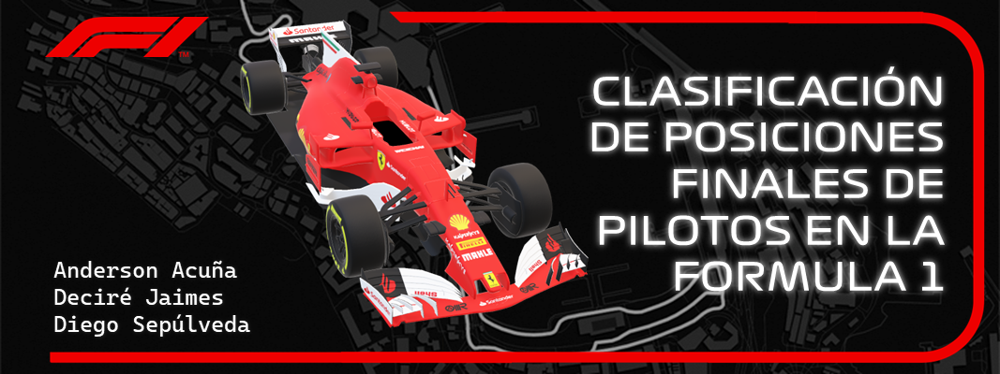

# Clasificación de Posiciones Finales de Pilotos en la Fórmula 1

Modelo de predicción del puesto final de un corredor de Formula 1, usando algoritmos de inteligencia artificial.

**Autores:**
Anderson Yeseth Acuña Vargas, Deciré Dayana Jaimes Rodríguez, Diego Fabián Sepúlveda Durán

**Objetivo principal:**
Utilizar los distintos métodos de clasificación vistos en clase para analizar datos históricos e intentar predecir la posición final del piloto.

**Datasets usados:** https://www.kaggle.com/datasets/rohanrao/formula-1-world-championship-1950-2020/data & https://www.kaggle.com/datasets/cjgdev/formula-1-race-data-19502017 

**Vídeo explicativo:** 
